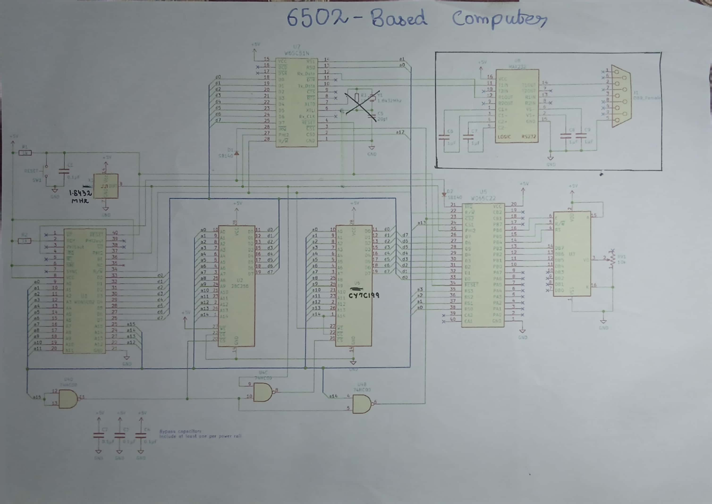

# 🖥️ BEN — A Homebrew 6502 Computer

> *Hand-built. Hand-wired. Fully yours.*

[](https://github.com)
[](https://en.wikipedia.org/wiki/MOS_Technology_6502)
[]()
[]()
[]()

---

## 📸 Photos

<!-- Add your photos below — replace the placeholder paths with your actual image files -->

| The Board | Close-Up | Running |
|:---------:|:--------:|:-------:|
|  |  |  |


---

## 🔧 Overview

**BEN** is a fully functional homebrew 8-bit computer built around the legendary **MOS 6502** processor — the same chip that powered the Apple II, Commodore 64, and original NES. Every wire was soldered by hand. Every line of code was written from scratch.

### Features

- **CPU**: MOS 6502 (or WDC 65C02) @ 1.8432 MHz
- **RAM**: 16 KB static RAM
- **ROM**: 32 KB EEPROM (programmed using tommyprom)
- **Serial**: UART via [chip, e.g. 6551 ACIA ] — full duplex serial communication
- **Audio**: Speaker output driven by [VIA timer  / etc.]
- **I/O**: 6522 VIA (Versatile Interface Adapter) for GPIO, timers, and interrupts
- **Display**: [LCD PANEL / terminal via UART ]
- **Clock**: Crystal oscillator / 555 timer circuit @ ___ Hz

---

## 🗺️ Memory Map

```
┌─────────────────────────────────────────────────────────┐
│                   6502 MEMORY MAP                       │
├──────────┬──────────┬──────────────────────────────────┤
│  START   │   END    │  DESCRIPTION                     │
├──────────┼──────────┼──────────────────────────────────┤
│ $0000    │ $00FF    │  Zero Page (fast access RAM)      │
│ $0100    │ $01FF    │  Stack                            │
│ $0200    │ $3FFF    │  General Purpose RAM              │
│ $6000    │ $600F    │  VIA (6522) I/O Registers         │
│ $5000    │ $500F    │  UART (ACIA) Registers            │
│ $8000    │ $FFFF    │  ROM (EEPROM)                     │
│ $FFFA    │ $FFFB    │  NMI Vector                       │
│ $FFFC    │ $FFFD    │  RESET Vector                     │
│ $FFFE    │ $FFFF    │  IRQ/BRK Vector                   │
└──────────┴──────────┴──────────────────────────────────┘
```


## 📐 Schematics

<!-- Add your schematic images below -->

### Full Schematic



---

## 🧰 Bill of Materials

| Component | Part | Qty |
|-----------|------|-----|
| CPU | MOS 6502 / WDC 65C02 | 1 |
| ROM | 28C256 EEPROM | 1 |
| RAM | CY7C199 SRAM | 1 |
| I/O | 6522 VIA | 1 |
| Serial | 6551 ACIA / 65C51 | 1 |
| Clock | Crystal  | 1 |
| Speaker | 8Ω speaker + LM386 | 1 |
| Address decoder | 74HC00 | 1 |
| Power | 5V Wall adpater regulator | 1 |
| Misc | Caps, resistors, wire | lots |


---

## 💾 Software

### WOZMonitor 
A simple WOZMMON machine code monitor lets you:
- Inspect and modify memory
- Jump at any adress

### MSbasic 
A high level lanuage developed by bill gates and his two employess for 6502:


### UART Communication
Serial terminal connection at **___ baud, 8N1**.  
Use any terminal emulator: `minicom`, PuTTY, `screen`, etc.


### Speaker / Audio
The speaker is driven by [VIA timer] to produce square-wave tones. Currently capable of [beeps / sqaure wave music].

---

## 🔨 Build Notes

### Things I Learned the Hard Way

- Always decouple **every** chip with a 100nF cap — seriously, every one
- The 6502 needs its clock to be clean; scope it before pulling your hair out
- EEPROM programming at 5V vs 3.3V — double-check your programmer settings
- Address decoding bugs are the sneakiest — label your bus lines
- When in doubt, it's a ground issue


---

## 📚 Resources & Inspiration

- [Ben Eater's 6502 Series](https://eater.net/6502) — the legend himself
- [6502.org](http://www.6502.org) — the community hub
- [WDC 65C02 Datasheet](https://www.westerndesigncenter.com/wdc/documentation/w65c02s.pdf)
- [6522 VIA Datasheet](http://www.westerndesigncenter.com/wdc/documentation/w65c22.pdf)
- *The 6502 Application Book* — various

---

## 🚀 Future Plans

- [ ] PS/2 keyboard input
- [ ] VGA or composite video output
- [ ] SD card storage
- [ ] Expanded RAM (bank switching)
- [ ] Proper PCB (KiCad)
- [ ] BASIC interpreter in ROM
- [ ] Custom OS

---

## 🙋 About

Built by **[MUHAMMAD UMAR]** because there's something magical about knowing every single transistor your code runs on.

If you build something inspired by this — I'd love to see it.  
Open an issue, send a PR, or just star the repo ⭐

---

*Made with solder fumes and stubbornness.*
